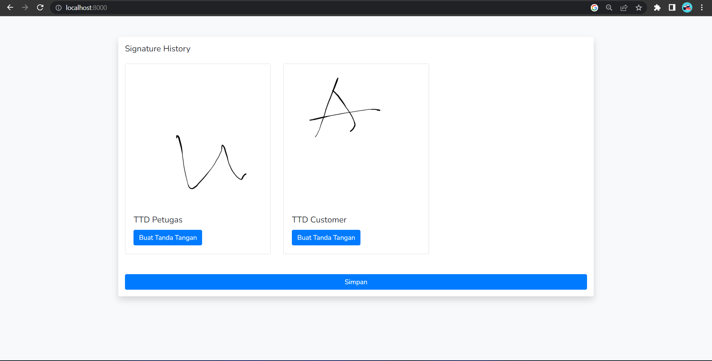
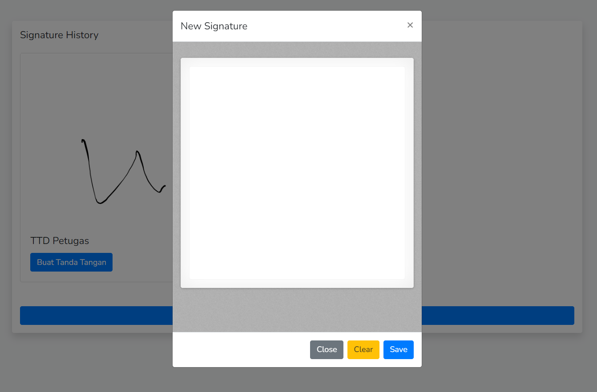

# This example using Signature Pad 

source : https://github.com/szimek/signature_pad

# Steps to running

* composer update
* php artisan migrate
* php artisan storage:link
* php artisan serve --port=8000

# How to use

* copy dir **public/assets/** to your dir project

